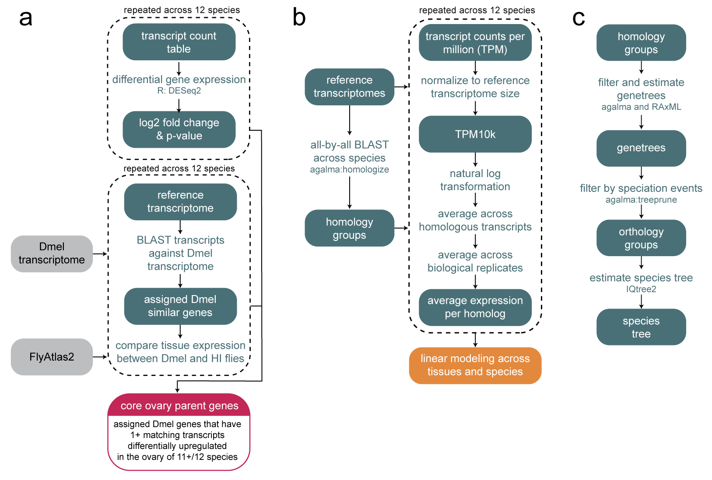
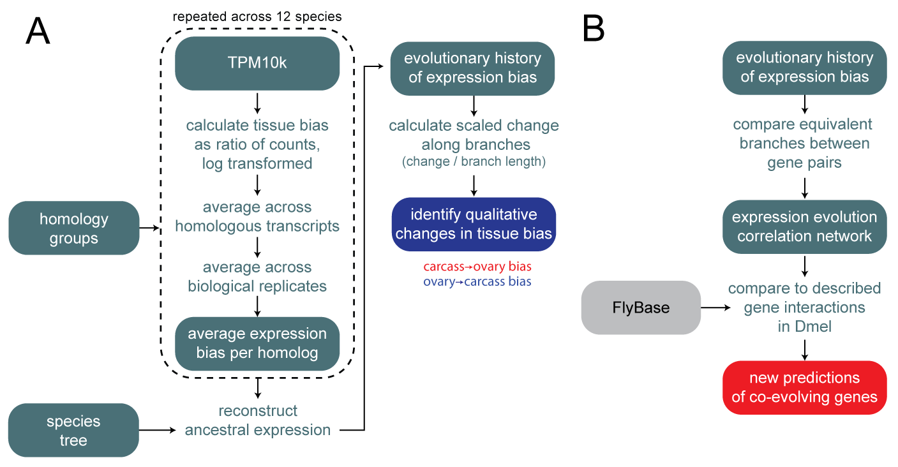
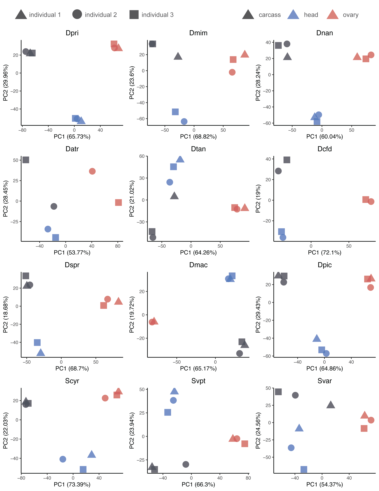
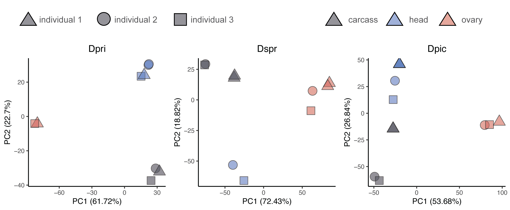

\makeatletter
\renewcommand{\thefigure}{S\@arabic\c@figure}
\renewcommand{\thetable}{S\@arabic\c@table}
\makeatother

```{r global options, include = FALSE}
knitr::opts_chunk$set(echo=FALSE, include = FALSE, warning=FALSE, message=FALSE, cache=FALSE)

library(hutan)
library(digest)
library(agalmar)
library(ape)
library(jsonlite)
library(parallel)
library(treeio)
library(tidyverse)
library(Rphylopars)
library(ggrepel)
library(DESeq2)
library(gridExtra)
library(pbapply)
library(ggfortify)
library(qgraph)
theme_set(theme_classic())
options(tinytex.clean=FALSE) # keeps aux file for main manuscript
set.seed(84095)
```

```{r run-all}
#    source("analysis/read_in_expression.R")
#    source("analysis/differential_expression/significance_and_flyatlas.R")
#    source("analysis/ANOVA/tissues_and_species.R")
#    source("analysis/phylogenetic_expression/phylogenetic_analysis.R")
#    
#    source("analysis/ANOVA/tissues_and_species_anova_pair.R")
#    source("analysis/ANOVA/tissues_and_species_ortholog.R")
#    
#    anova_results <- list(anova_ov_PW_red_results,anova_ov_red_results)
#    save(anova_results,file="analysis/results_Robjects/selected_anova_results.RData")
#    
#    parameters <- list(pseudocount,min_tips_for_asr,correlation_threshold,core_genes_threshold)
#    save(parameters,file="analysis/results_Robjects/parameters.RData")
#    
#    n_sig <- list(n_total,n_sig_down,n_sig_up,frac_sig_core)
#    save(n_sig,file="analysis/results_Robjects/n_significant.RData")
#    
#    head_n_sig <- list(head_n_total,head_n_sig_down,head_n_sig_up)
#    save(head_n_sig,file="analysis/results_Robjects/head_n_significant.RData")
#    
#    t_test_results <- list(physical_t_test,enhance_t_test,suppress_t_test,enhance_suppress_t_test)
#    save(t_test_results,file="analysis/results_Robjects/t_test_results.RData")
#    
#    save(core_parent_genes,file="analysis/results_Robjects/core_parent_genes.RData")
#    save(full_cormat,file="analysis/results_Robjects/full_correlation_matrix.RData")
#    save(target_int_changes,file="analysis/results_Robjects/target_int_changes.RData")
#    save(genetree_all_dmel_id,file="analysis/results_Robjects/genetree_all_dmel_id.RData")
#    save(ovary_changes,file="analysis/results_Robjects/ovary_changes.RData")    
#    save(ave_ratio_summary,file="analysis/results_Robjects/ovary_average_ratio.RData")      
#
#    source("analysis/head_analyses/head_significance_and_flyatlas.R")
#    source("analysis/head_analyses/head_tissues_and_species.R")
#    source("analysis/head_analyses/head_phylogenetic_analysis.R")
#    
#    save(head_parent_genes,file="analysis/results_Robjects/head_parent_genes.RData")
#    
#    head_t_test_results <- list(physical_t_test,enhance_t_test,suppress_t_test,enhance_suppress_t_test)
#    save(head_t_test_results,file="analysis/results_Robjects/head_t_test_results.RData")
```

```{r load-data, cache=FALSE}
load(file="analysis/results_Robjects/selected_anova_results.RData")
load(file="analysis/results_Robjects/parameters.RData")
load(file="analysis/results_Robjects/t_test_results.RData")
load(file="analysis/results_Robjects/head_t_test_results.RData")
load(file="analysis/results_Robjects/full_correlation_matrix.RData")
load(file="analysis/results_Robjects/target_int_changes.RData")
load(file="analysis/results_Robjects/n_significant.RData")
load(file="analysis/results_Robjects/head_n_significant.RData")
load(file="analysis/results_Robjects/core_parent_genes.RData")
load(file="analysis/results_Robjects/head_parent_genes.RData")
load(file="analysis/results_Robjects/genetree_all_dmel_id.RData")
load(file="analysis/results_Robjects/ovary_changes.RData")
load(file="analysis/results_Robjects/ovary_average_ratio.RData")

collection_info <- read.delim("expression_methods_data/collection_information.tsv",stringsAsFactors=F,sep="\t",header=T,check.names=F)

summarize_anova_results <- function(anova_results){
  anova_res_sum <- anova_results %>% 
  mutate(genetree = rownames(anova_results)) %>% 
  rowwise() %>% 
  mutate(total_SS = sum(treatment_SS,species_SS,Residuals_SS),
    prop_species = species_SS/total_SS,
    prop_treatment = treatment_SS /total_SS,
    sum_prop = sum(prop_treatment,prop_species),
    VG = ifelse(sum_prop > 0.75,
        ifelse(prop_species > (2*prop_treatment),"SVG",
          ifelse(prop_treatment > (2*prop_species),"TVG",
          "NO")),"NO")) %>% as.data.frame()
  return(anova_res_sum)
}
```

\vspace{12pt}
^1^ Department of Organismic and Evolutionary Biology, Harvard University, Cambridge, MA 02138, USA

^2^ Current address:  Department of Ecology and Evolutionary Biology, Yale University, New Haven, CT 06520, USA

^3^ Collège de France, PSL Research University, CNRS, Inserm, Center for Interdisciplinary
Research in Biology, 75005 Paris, France

^4^ Department of Molecular and Cellular Biology, Harvard University, Cambridge, MA 02138, USA

^5^ Howard Hughes Medical Institute, Chevy Chase, MD 20815

\* corresponding author: samuelhchurch@gmail.com

# Supplementary figures

## Background


```{r atlas-max,include=T,results=T,fig.cap="**Comparing across _Drosophila melanogaster_ female tissues in the  FlyAtlas2 dataset[@leader2018flyatlas], more genes show highest enrichment in the ovary than any other tissue.**"}
flyatlas <- read.delim("analysis/data/120721_FlyAtlas2_sqldump.csv",sep=",",stringsAsFactors=F,header=T) %>% 
                filter(type == "protein coding")
flyatlas_f <- flyatlas %>% filter(stage == "Adult",sex == "Female") %>% # female only values
                select(-stage,-sex)
flyatlas_ref <- flyatlas_f %>% filter(tissue_reference == "Yes") %>% # from FlyAtlas instructions, enrichment is calculated of reference tissue
                mutate(refFPKM = ifelse(FPKM>2,FPKM,2)) %>% 
                select(parent_gene,refFPKM)
flyatlas_en <- flyatlas_f %>% left_join(.,flyatlas_ref,by="parent_gene") %>% # calculate tissue enrichment values
                filter(tissue_reference == "No") %>% 
                mutate(enrichment = FPKM / refFPKM) %>% 
                select(-tissue_reference)

atlas_max <- ggplot(flyatlas_en %>% group_by(parent_gene) %>% arrange(desc(enrichment)) %>% filter(row_number()==1),aes(x = tissue)) + geom_bar() + ylab("number of genes with maximum\nenrichment in each tissue") + xlab("tissue") + coord_flip()
print(atlas_max)
```

## Analysis pipeline





## Differential gene expression

{width=90%}

{width=90%}

{width=90%}



![(#fig:atlas-enrichment) **Differential gene expression analysis across species, colored by _D. melanogaster_ expression enrichment.** Points in cyan indicate transcripts that match _D. melanogaster_ genes that are not highly enriched in the ovary, according to FlyAtlas2[@leader2018flyatlas]. Orange are transcripts matching genes that are highly enriched in the ovary. Black are transcripts without a BLAST match in _D. melanogaster_. Gray are non-significantly differentially expressed transcripts.](figures_and_panels/Figure_atlas_enrichment_V3-01.png)

![(#fig:head-core-genes) **Differential gene expression analyses comparing head and carcass, colored by _D. melanogaster_ expression enrichment.** A, Core head genes, plotted by mean expression change across Hawaiian species to the maximum head, brain, or eye enrichment values from _D. melanogaster_, as reported in FlyAtlas2[@leader2018flyatlas]. Core genes are annotated with the gene symbol from _D. melanogaster_. B, Tissue-variable genes identified in a linear model analysis comparing head and carcass tissues, showing head-upregulated TVGs. Genes are annotated with the gene symbol from the _D. melanogaster_ sequences in the same homology group.](figures_and_panels/Figure_head_core_genes_V1-01.png)

![(#fig:head-atlas-enrichment) **Differential gene expression analyses comparing head and carcass, colored by _D. melanogaster_ expression enrichment.** A, Points in cyan indicate transcripts that match _D. melanogaster_ genes that are not highly enriched in the head, according to FlyAtlas2[@leader2018flyatlas]. Orange are transcripts matching genes that are highly enriched in the head. Black are transcripts without a BLAST match in _D. melanogaster_. Gray are non-significantly differentially expressed transcripts. B, The same plot, with purple points as transcripts that are highly enriched in the head, brain, or eye of _D. melanogaster_.](figures_and_panels/Figure_head_atlas_enrichment_V1-01.png){width=100%}

## Linear modeling

![(#fig:homology-orthology) **Representation across homology and orthology groups.** A, The number of target species with expression data per homology group, inferred with the agalma pipeline using an all-by-all BLAST approach between the twelve reference transcriptomes and twelve other published Drosophilidae genomes. Groups with zero species are those that contain only genes from the species with published genomes, and not the twelve target species sequenced this study. B, The number of target species with expression data per orthology group, inferred with the agalma pipeline, using gene trees to identify orthologs.](figures_and_panels/Figure_gene_representation_V3-01.png)


## Phylogenetic analysis 

{width=75%}

![(#fig:head-bias-changes) **Changes in head-biased expression evolution.** Four genes displaying large swings in relative head expression, showing the expression bias for each transcript colored according to more expression in the head (red) or carcass (blue). Panels are annotated with the gene symbol from the _D. melanogaster_ sequences in the same homology group, with the exception of _vilya_\*, which was annotated using a direct BLAST search since no _D. melanogaster_ sequence was present in that group.](figures_and_panels/Figure_head_bias_change_examples_V1-01.png){width=75%}

![(#fig:head-correlations) **Evolutionary correlations based on head-biased expression evolution.** A-B Comparison of the dsitribution of Pearson's correlation coefficients based on head-biased expression evolution between genes. Asterisks indicate a significant t-test comparison. Box plots indicate mean, upper and lower quartiles, and 1.5x interquartile ranges. A, Genes with no or unknown protein-protein interactions compared to those with reported interactions in FlyBase[@larkin2021flybase]  (maximum p-value=`r round(max(head_t_test_results[[1]]),3)` over 100 replicates). B, Correlation comparison between genes with no or uknown genetic interactions and those reported to have enhancement or suppression interactions in FlyBase (unknown vs. enhancemenet max. p-value=`r gsub("0","<0.001",round(max(head_t_test_results[[2]]),3))`; unknown vs. suppression max. p-value=`r gsub("0","<0.001",round(max(head_t_test_results[[3]]),3))`; enhancement vs. suppression p-value=`r round(head_t_test_results[[4]]$p.value,3)`). C, The network of strong correlation partners (absolute correlation > `r parameters[[3]]`) with the yolk-protein genes, colored by the direction of correlation. Stronger correlations are shown by brighter colors, and thicker, shorter lines. Nodes are annotated with the gene symbols from the _D. melanogaster_ sequences from that homology group.](figures_and_panels/Figure_head_correlations_V2-01.png)

# Tables 

## Collection and sequencing

```{r collection-info,include=T,results=T}
knitr::kable(collection_info %>% 
    mutate("GPS" = paste(`GPS N`,`GPS W`,sep=" ")) %>% 
    select(-c('dissection date','days elapsed before dissection','RNA extraction date','days elapsed before RNA extraction','GPS W','GPS N')),
        align=rep('l', ncol(collection_info)),
        caption="Field collection information for sequenced specimens.", booktabs = T, longtable = T, linesep = "") %>% 
    kableExtra::column_spec(c(4,3,7),width="5em") %>% 
    kableExtra::column_spec(c(2),italic=T) %>% 
    kableExtra::column_spec(c(2,5),width="5em") %>% 
    kableExtra::column_spec(c(2,8),width="7em") %>% 
    kableExtra::column_spec(c(6),width="11em") %>%
    kableExtra::kable_styling(latex_options = "striped") %>%
    kableExtra::kable_styling(latex_options = "HOLD_position") %>% 
    kableExtra::kable_styling(latex_options = "repeat_header")  %>%
    kableExtra::kable_styling(font_size = 6) 
```

```{r barcode-info,include=T,results=T}
barcode_info <- read.delim("expression_methods_data/barcode_information.tsv",stringsAsFactors=F,sep="\t",header=T,check.names=F) 

knitr::kable(barcode_info,
        align=rep('l', ncol(collection_info)),
        caption="DNA barcoding for identification of females.", booktabs = T, longtable = TRUE, linesep = "") %>% 
    kableExtra::column_spec(c(1,2,4,5,6),width="6em") %>%
    kableExtra::column_spec(c(7),width="12em") %>%
    kableExtra::column_spec(c(3),italic=T) %>% 
    kableExtra::kable_styling(latex_options = "striped") %>%
    kableExtra::kable_styling(latex_options = "HOLD_position") %>% 
    kableExtra::kable_styling(latex_options = "repeat_header")  %>%
     kableExtra::kable_styling(font_size = 6) 
```

```{r paired-reads-info,include=T,results=T}
reads_info <- read.delim("expression_methods_data/paired_end_reads_information.tsv",stringsAsFactors=F,sep="\t",header=T,check.names=F)

knitr::kable(reads_info,
      align=c('llllrrrr'),
       caption="Paired-end sequencing read counts.", booktabs = T, longtable = TRUE, linesep = "") %>% 
    kableExtra::column_spec(c(1),italic=T) %>% 
    kableExtra::column_spec(c(2,3,5,6,7,8),width="5em") %>%
    kableExtra::kable_styling(latex_options = "striped") %>%
    kableExtra::kable_styling(latex_options = "HOLD_position") %>% 
    kableExtra::kable_styling(latex_options = "repeat_header")  %>%
    kableExtra::kable_styling(font_size = 6) 
```

```{r single-reads-info,include=T,results=T}
reads_info <- read.delim("expression_methods_data/single_end_reads_information.tsv",stringsAsFactors=F,sep="\t",header=T,check.names=F)

knitr::kable(reads_info,
      align=c('lllllrrrrr'),
       caption="Single-end sequencing read counts.", booktabs = T, longtable = TRUE, linesep = "") %>% 
    kableExtra::column_spec(c(1),italic=T) %>% 
    kableExtra::column_spec(c(2,3,4,5,6,7,8,9,10),width="4.5em") %>%
    kableExtra::kable_styling(latex_options = "striped") %>%
    kableExtra::kable_styling(latex_options = "HOLD_position") %>% 
    kableExtra::kable_styling(latex_options = "repeat_header")  %>%
    kableExtra::kable_styling(font_size = 6) 
```

```{r genetree-stats-table,include=T,results=T}
genetree_table <- ave_ratio_summary %>% select(-sp_code) %>%
    group_by(species,genetree) %>% tally() %>% 
    mutate(species = gsub("cf","cf ",species)) %>% 
    mutate(species = gsub("Drosophila","D.",species)) %>% 
    mutate(species = gsub("Scaptomyza","S. ",species)) %>% 
    mutate(species = gsub("_","  ",species)) %>% 
    group_by(species) %>% summarize("homology groups" = n(),
        "groups with more than one transcript" = count(n>1),
        "max num. transcripts per group" = max(n),
        "ave num. transcripts per group" = round(mean(n),2)) %>% 
    arrange(species)

knitr::kable(genetree_table,
      align=c('lrrrr'),
       caption="Number of transcripts per homology group per species.", booktabs = T, longtable = TRUE, linesep = "", format.args = list(big.mark = ",")) %>% 
    kableExtra::column_spec(c(1),italic=T) %>% 
    kableExtra::column_spec(c(2,3,4,5),width="7em") %>%
    kableExtra::kable_styling(latex_options = "striped") %>%
    kableExtra::kable_styling(latex_options = "HOLD_position") %>% 
    kableExtra::kable_styling(latex_options = "repeat_header")  %>%
    kableExtra::kable_styling(font_size = 6) 
```

## Core genes

```{r core-ovary-table,include=T,results=T}
core_genes_table <- core_parent_genes %>% left_join(.,genetree_all_dmel_id %>% 
    mutate(genetree_name = name) %>% 
    select(genetree,genetree_name),by="genetree") %>% 
  distinct(parent_gene,name,genetree,genetree_name)
core_no_genetree <- core_genes_table %>% filter(is.na(genetree))
core_genetree <- core_genes_table %>% filter(!is.na(genetree))
 
core_genes_table <- core_genetree %>% mutate(present = ifelse(parent_gene %in% core_no_genetree$parent_gene,"some","all")) %>% 
  bind_rows(.,core_no_genetree %>% filter(!(parent_gene %in% core_genetree$parent_gene)) %>% mutate(present = "none")) %>%
  mutate(genetree_name=ifelse(is.na(genetree_name),ifelse(is.na(genetree),"none","no Dmel match"),genetree_name)) %>% 
  select(-genetree) %>% distinct(parent_gene,name,present,genetree_name) %>% arrange(name)

collection_info <- read.delim("expression_methods_data/collection_information.tsv",stringsAsFactors=F,sep="\t",header=T,check.names=F)
 
knitr::kable(core_genes_table %>% 
    mutate("Dmel parent gene ID" = parent_gene,
    "Dmel parent gene symbol" = name,
    "transcripts in homology group" = present,
    "homology group Dmel sequence symbols" = genetree_name) %>% 
    select(c('Dmel parent gene ID','Dmel parent gene symbol','transcripts in homology group','homology group Dmel sequence symbols')),
        align=rep('l', ncol(collection_info)),
        caption="Core ovary genes.", booktabs = T, longtable = T, linesep = "") %>% 
    #kableExtra::column_spec(c(1,2,3,4),width="10em") %>% 
    kableExtra::kable_styling(latex_options = "striped") %>%
    kableExtra::kable_styling(latex_options = "HOLD_position") %>% 
    kableExtra::kable_styling(latex_options = "repeat_header")  %>%
    kableExtra::kable_styling(font_size = 6) 
```

```{r core-head-table,include=T,results=T}
load("figures_and_panels/head_figures_and_panels/head_parent_genes.RData")

head_genes_table <- head_parent_genes %>% left_join(.,genetree_all_dmel_id %>% 
    mutate(genetree_name = name) %>% 
    select(genetree,genetree_name),by="genetree") %>% 
  distinct(parent_gene,name,genetree,genetree_name)
head_no_genetree <- head_genes_table %>% filter(is.na(genetree))
head_genetree <- head_genes_table %>% filter(!is.na(genetree))
 
head_genes_table <- head_genetree %>% mutate(present = ifelse(parent_gene %in% head_no_genetree$parent_gene,"some","all")) %>% 
  bind_rows(.,head_no_genetree %>% filter(!(parent_gene %in% head_genetree$parent_gene)) %>% mutate(present = "none")) %>%
  mutate(genetree_name=ifelse(is.na(genetree_name),ifelse(is.na(genetree),"none","no Dmel match"),genetree_name)) %>% 
  select(-genetree) %>% distinct(parent_gene,name,present,genetree_name) %>% arrange(name)

knitr::kable(head_genes_table %>% 
    mutate("Dmel parent gene ID" = parent_gene,
    "Dmel parent gene symbol" = name,
    "transcripts in homology group" = present,
    "homology group Dmel sequence symbols" = genetree_name) %>% 
    select(c('Dmel parent gene ID','Dmel parent gene symbol','transcripts in homology group','homology group Dmel sequence symbols')),
        align=rep('l', ncol(collection_info)),
        caption="Core head genes.", booktabs = T, longtable = T, linesep = "") %>% 
    #kableExtra::column_spec(c(1,2,3,4),width="10em") %>% 
    kableExtra::kable_styling(latex_options = "striped") %>%
    kableExtra::kable_styling(latex_options = "HOLD_position") %>% 
    kableExtra::kable_styling(latex_options = "repeat_header")  %>%
    kableExtra::kable_styling(font_size = 6) 
```


## References 

```{r save}
#save.image("Hawaiian_transcriptome_supplement.RData")
```

